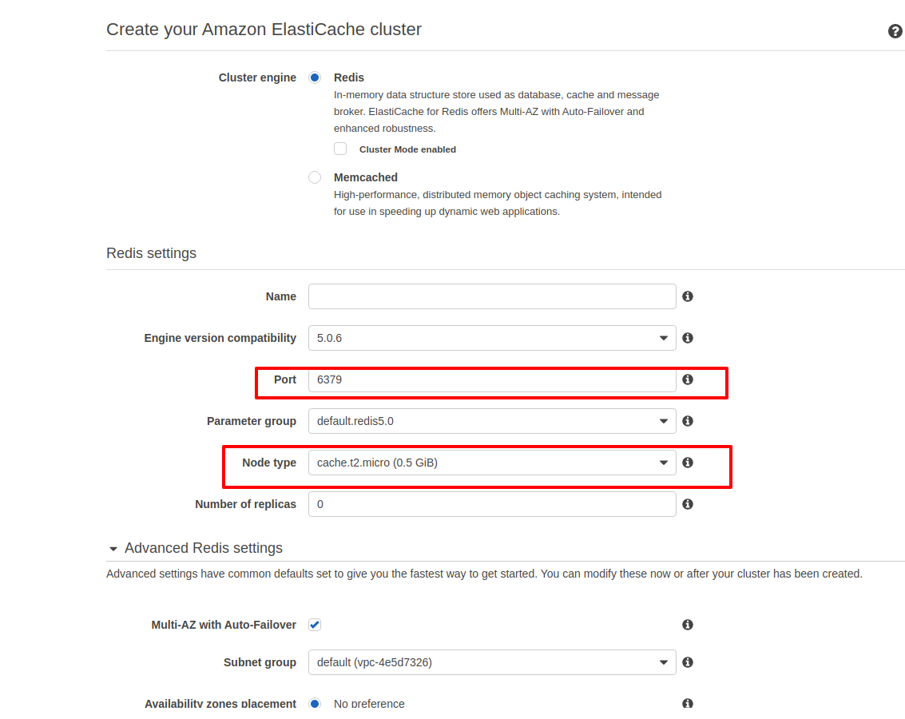
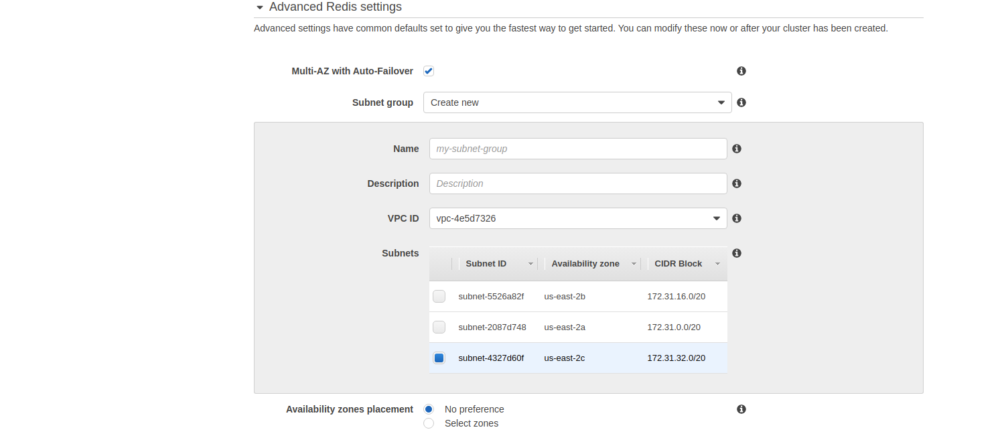
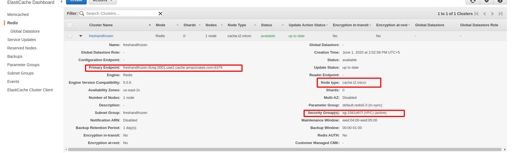
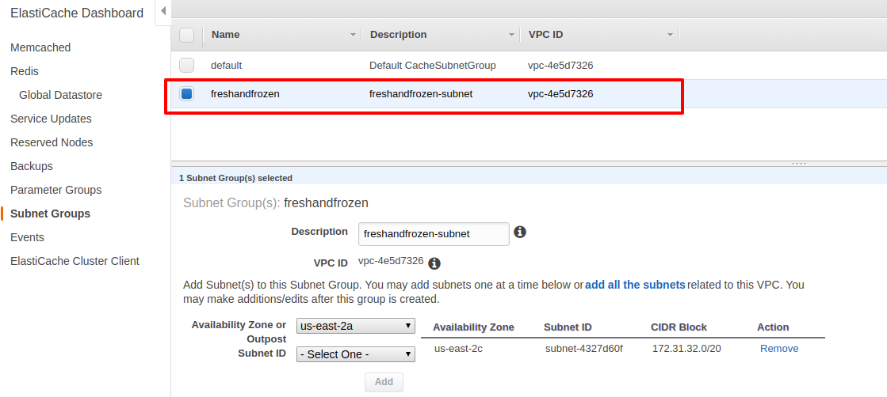
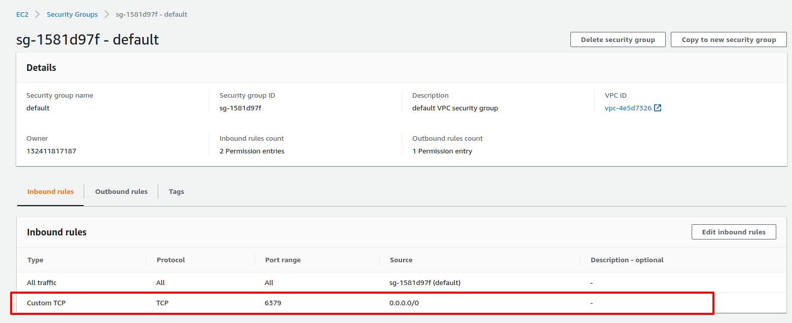

# Sidekiq-redis-setup-on-aws-production

### Assuming that the Active job mailer is implemented.

## Setting up Sidekiq (to run background processes)

```
# in your Gemfile
gem install sidekiq 
```
After installing the gem, It will also add the redis gem

- Active Job will also need to be configured in your application to use sidekiq with Action Mailer. In `/config/application.rb` you can add the setting:
```
config.active_job.queue_adapter = :sidekiq
```
## Sample Active job file where we are sending email

```
class PaymentProofJob < ApplicationJob
  queue_as :default

  def perform(email_sender, email_subject, email_body)

    SupplierMailer.send_proof_of_payment(email_sender, email_subject, email_body).deliver_now
  end
end
```
- Using deliver_now for sending email at the same time in background

- Now our application configuration is pretty much complete, but we have to get redis working in our production environment. From your AWS dashboard select ElastiCache under the database heading.

## Setting up the ElastiCache (Redis server) on Production

- Create new Cluster to setup redis server



- Now add the subnet group 



After creating cluster looks something like this: 



## Details of Subnet Group which was created with cluster:



## VPC security group: (Added new inbound restriction for port 6379):



## For production: We will now need a configuration file for sidekiq created in `/config/initializers/sidekiq.rb`
- Place the redis url code in that file with the Primary Endpoint generated by Redis (ElastiCache)

```
Sidekiq.configure_server do |config|
  config.redis = { url: 'redis://freshandfrozen.ficiwj.0001.use2.cache.amazonaws.com:6379' }
end

Sidekiq.configure_client do |config|
  config.redis = { url: 'redis://freshandfrozen.ficiwj.0001.use2.cache.amazonaws.com:6379' }
end
```
- After this step restart the app server

Now For running the sidekiq in background we also need to create a sidekiq service which will run in background

## Creating the sidekiq.service file in /lib/systemd/system

Place the following given code and update w.r.t application 

- The working directory path, change this to you application path, for example:
`WorkingDirectory=/home/deploy/my_app/current`

```
#
# Sidekiq auto start using systemd unit file for Ubuntu 16.04
#
# Put this in /lib/systemd/system (Ubuntu).
# Run:
#   1. systemctl enable sidekiq (to enable sidekiq service)
#   2. systemctl {start,stop,restart} sidekiq (to start sidekiq service)
#
# This file corresponds to a single Sidekiq process.  Add multiple copies
# to run multiple processes (sidekiq-1, sidekiq-2, etc).
#
# See Inspeqtor's Systemd wiki page for more detail about Systemd:
# https://github.com/mperham/inspeqtor/wiki/Systemd
#
[Unit]
Description=sidekiq
# start us only once the network and logging subsystems are available,
# consider adding redis-server.service if Redis is local and systemd-managed.
After=syslog.target network.target

# See these pages for lots of options:
# http://0pointer.de/public/systemd-man/systemd.service.html
# http://0pointer.de/public/systemd-man/systemd.exec.html
[Service]
Type=simple
WorkingDirectory=/home/ubuntu/production/adventist_chs
# If you use rbenv or rvm:
ExecStart=/bin/bash -lc 'bundle exec sidekiq -e production'
# If you use the system's ruby:
# ExecStart=bundle exec sidekiq -e production
User=ubuntu
##Group=your-username
##UMask=0002

# if we crash, restart
RestartSec=1
Restart=on-failure

# output goes to /var/log/syslog
StandardOutput=syslog
StandardError=syslog

# This will default to "bundler" if we don't specify it
SyslogIdentifier=sidekiq

[Install]
WantedBy=multi-user.target
```

After creating sidekiq.service file save this and run the following commands

```
sudo systemctl enable sidekiq
```
- In order to start and restart service
```
sudo service sidekiq {start, restart, status}
```
